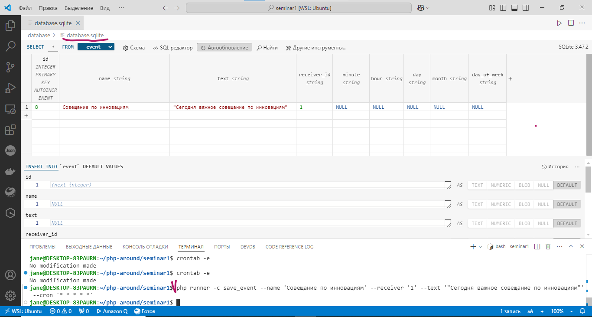
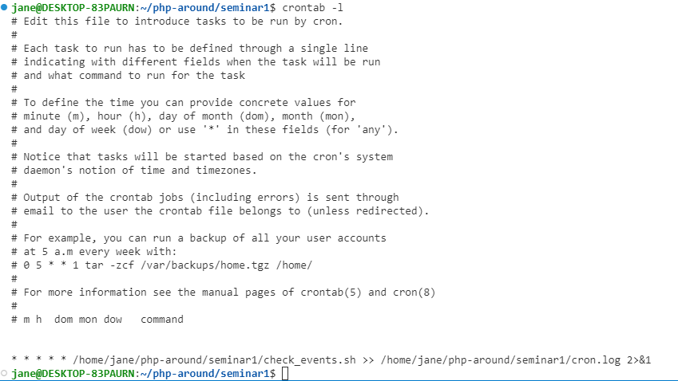
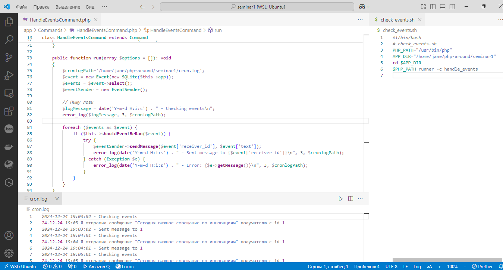
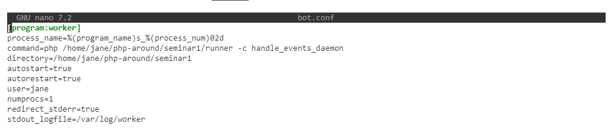
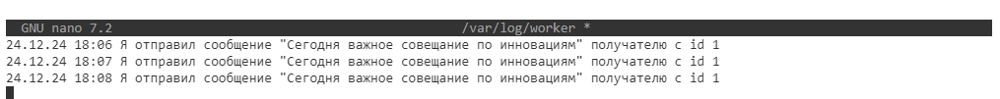

# PHP-AROUND. Homework 1. Тогочакова Евгения
## Работа с консольным микрофреймворком
1.Реализация сохранения правил<br>
На вход подана строка:
```
php runner -c save_event --name 'Совещание по инновациям' --receiver '1' --text '"Сегодня важное совещание по инновациям"' --cron '* * * * *'
```

Реализована логика обработки этого сообщения и сохранения его в базу данных.


2.Реализация скрипта, который проверяет, есть ли задания на отправку в эту минуту, и делает нужные действия с использованием crontab

Нужно реализовать скрипт-обработчик заданий на отправку в мессенджер.
Для этого нужно получить все задания из базы данных и сравнить значения времени запуска с текущими минутой, часом, днем, месяцем и днем недели. 
Если значения совпадают, то отправляется сообщение через EventSender.<br>
Скриншот моего кронтаба:<br>



3.Реализация демона, который отправляет напоминания с использованием supervisorctl

Сделать то же самое, что и в задании № 3, но при этом важно, чтобы скрипт запускался как демон, то есть работал бесконечно. 
Для этого достаточно сделать бесконечный цикл while, из которого потом мы будем вызывать, созданный нами HandleEventsCommand. 
При этом продумайте механизм обработки HUP сигналов!
Если принят сигнал SIGTERM, SIGINT или SIGHUP, то скрипт должен сохранять текущие обрабатываемые минуту, час, день, месяц и день недели, которые потом подхватит и обработает при новом запуске.

Мой конфиг супервизора. Файл называется bot.conf и находится внутри /etc/supervisor/conf.d

<br>Управление через ```sudo supervisorctl start worker:worker_00```  и ```sudo supervisorctl stop worker:worker_00```               
Логи пишутся в /var/log/worker


4.Как вы считаете в каких задачах использование демонов лучше, чем использование crontab?<br>
Демоны лучше, когда требуется немедленный ответ на какие-либо события. Можно настроить так, что они будут что-либо проверять с любым интервалом, в том числе и в секундах. Демоны лучше, если логика их работы сложна и между операциями требуется сохранить какие-то данные и что-то с ними сделать.<br>
Крон лучше, если требуется работать по расписанию и есть четкое понимание времени, когда что-то должно делаться. При простой логике крона вполне достаточно. Писать задачи в кронтаб легко, задачи сразу понятны другим разработчикам, их легко отлаживать при ошибках. Однако крон мало подходит для задач, которые должны исполняться чаще, чем раз в минуту, т.к. секунд в его расписании нет...